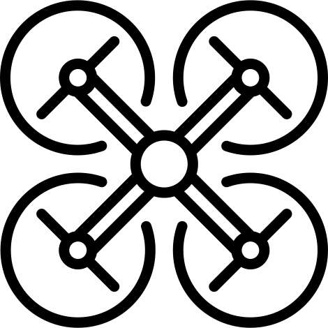

<!--
*** Thanks for checking out this README Template. If you have a suggestion that would
*** make this better, please fork the repo and create a pull request or simply open
*** an issue with the tag "enhancement".
*** Thanks again! Now go create something AMAZING! :D
***
***
***
*** To avoid retyping too much info. Do a search and replace for the following:
*** tomasjm, dronekit-ufro, TomJimenez05, t.jimenez03@ufromail.cl
-->


<!-- PROJECT SHIELDS -->
<!--
*** I'm using markdown "reference style" links for readability.
*** Reference links are enclosed in brackets [ ] instead of parentheses ( ).
*** See the bottom of this document for the declaration of the reference variables
*** for contributors-url, forks-url, etc. This is an optional, concise syntax you may use.
*** https://www.markdownguide.org/basic-syntax/#reference-style-links
-->
[![Contributors][contributors-shield]][contributors-url]
[![Forks][forks-shield]][forks-url]
[![Stargazers][stars-shield]][stars-url]
[![Issues][issues-shield]][issues-url]
[![MIT License][license-shield]][license-url]


<!-- PROJECT LOGO -->
<br />
<p align="center">
  <a href="https://github.com/tomasjm/dronekit-ufro">
    
  </a>

  <h3 align="center">Drone UFRO</h3>

  <p align="center">
    Código y documentación del desarrollo del Drone.
    <br />
    <a href="https://github.com/tomasjm/dronekit-ufro"><strong>Documentación</strong></a>
    <br />
    <br />
    <a href="https://github.com/tomasjm/dronekit-ufro/issues">Reportar Bug</a>
    ·
    <a href="https://github.com/tomasjm/dronekit-ufro/issues">Solicitar Mejora</a>
  </p>
</p>


<!-- TABLE OF CONTENTS -->
## Contenidos

- [Contenidos](#contenidos)
- [Sobre el proyecto](#sobre-el-proyecto)
  - [Construido con](#construido-con)
- [Como comenzar](#como-comenzar)
  - [Requisitos](#requisitos)
  - [Instalación y configuración de hardware](#instalaci%c3%b3n-y-configuraci%c3%b3n-de-hardware)
  - [Instalación](#instalaci%c3%b3n)
- [Modo de uso](#modo-de-uso)
- [Roadmap](#roadmap)
- [Licencia](#licencia)
- [Contacto](#contacto)
- [Agradecimientos](#agradecimientos)


<!-- ABOUT THE PROJECT -->
## Sobre el proyecto

[![Product Name Screen Shot][product-screenshot]](https://example.com)

Proyecto que se basa en la construcción de un Drone **programable y automatico**, y a la vez, que sea **accesible/economico**.

### Construido con

* [Raspberry Pi 3](https://www.raspberrypi.org/products/raspberry-pi-3-model-b/)
* [Emlid Navio2](https://emlid.com/navio/)
* [Dronekit](https://dronekit.io/)


<!-- GETTING STARTED -->
## Como comenzar

En este repositorio se encuentra el código y los scripts para realizar la automatización y configuración del drone, sin embargo, son necesarios algunos requisitos.

### Requisitos

* Raspberry Pi 3
* Emlid Navio2
* Python 3.7
* Conocimientos de Linux

El drone está construido con la placa Emlid Navio2 que es un shield de raspberry pi 3 para drones, contiene todo lo necesario para hacer funcionar un drone.

### Instalación y configuración de hardware
 
1. Es necesario hacer uso de 
```sh
git clone https:://github.com/tomasjm/dronekit-ufro.git
```
2. Install NPM packages
```sh
npm install
```

### Instalación
 
1. Clone the dronekit-ufro
```sh
git clone https:://github.com/tomasjm/dronekit-ufro.git
```
2. Install NPM packages
```sh
npm install
```


<!-- USAGE EXAMPLES -->
## Modo de uso

Use this space to show useful examples of how a project can be used. Additional screenshots, code examples and demos work well in this space. You may also link to more resources.

_For more examples, please refer to the [Documentation](https://example.com)_


<!-- ROADMAP -->
## Roadmap

See the [open issues](https://github.com/tomasjm/dronekit-ufro/issues) for a list of proposed features (and known issues).


<!-- LICENSE -->
## Licencia

Distribuido bajo la licencia MIT.


<!-- CONTACT -->
## Contacto

Tomás Jiménez - [@TomJimenez05](https://twitter.com/TomJimenez05) - t.jimenez03@ufromail.cl

Arturo Avendaño - [@TomJimenez05](https://twitter.com/TomJimenez05) - t.jimenez03@ufromail.cl

Link del proyecto: [https://github.com/tomasjm/dronekit-ufro](https://github.com/tomasjm/dronekit-ufro)


<!-- ACKNOWLEDGEMENTS -->
## Agradecimientos

* [Universidad de la Frontera](https://www.ufro.cl/)
* [Departamento de Ingenieria Electrica](http://www.inele.ufro.cl/)
* [Ingenieria Civil Electronica](http://icelectronica.ufro.cl/)


<!-- MARKDOWN LINKS & IMAGES -->
<!-- https://www.markdownguide.org/basic-syntax/#reference-style-links -->
[contributors-shield]: https://img.shields.io/github/contributors/tomasjm/dronekit-ufro.svg?style=flat-square
[contributors-url]: https://github.com/tomasjm/dronekit-ufro/graphs/contributors
[forks-shield]: https://img.shields.io/github/forks/tomasjm/dronekit-ufro.svg?style=flat-square
[forks-url]: https://github.com/tomasjm/dronekit-ufro/network/members
[stars-shield]: https://img.shields.io/github/stars/tomasjm/dronekit-ufro.svg?style=flat-square
[stars-url]: https://github.com/tomasjm/dronekit-ufro/stargazers
[issues-shield]: https://img.shields.io/github/issues/tomasjm/dronekit-ufro.svg?style=flat-square
[issues-url]: https://github.com/tomasjm/dronekit-ufro/issues
[license-shield]: https://img.shields.io/github/license/tomasjm/dronekit-ufro.svg?style=flat-square
[license-url]: https://github.com/tomasjm/dronekit-ufro/blob/master/LICENSE.txt
[linkedin-shield]: https://img.shields.io/badge/-LinkedIn-black.svg?style=flat-square&logo=linkedin&colorB=555
[linkedin-url]: https://linkedin.com/in/tomasjm
[product-screenshot]: images/screenshot.png
